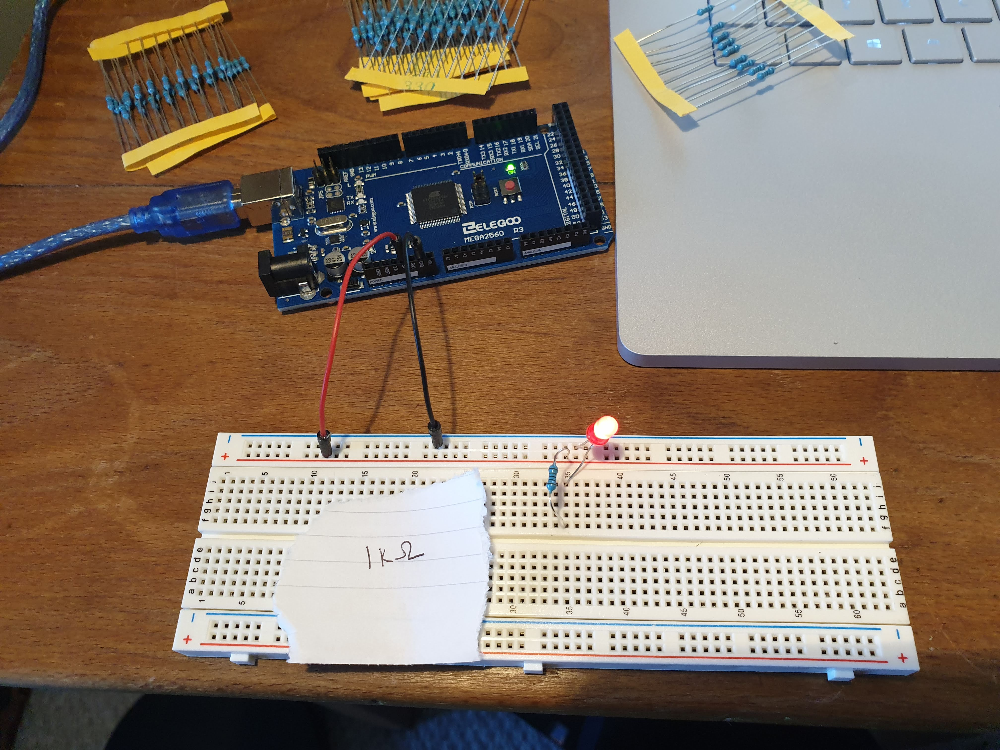
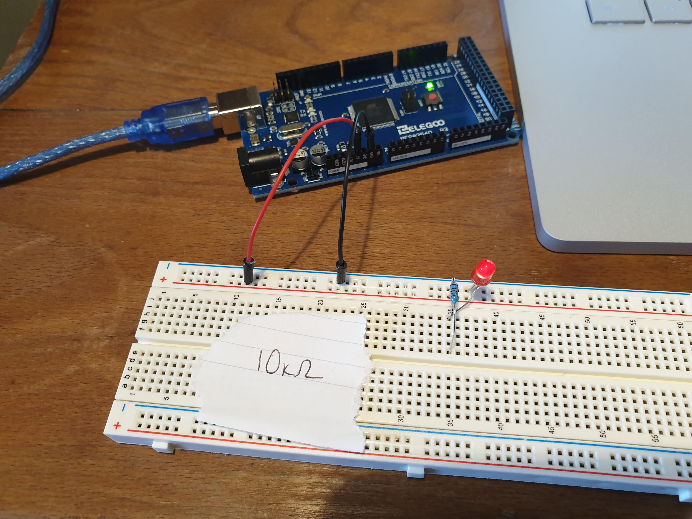
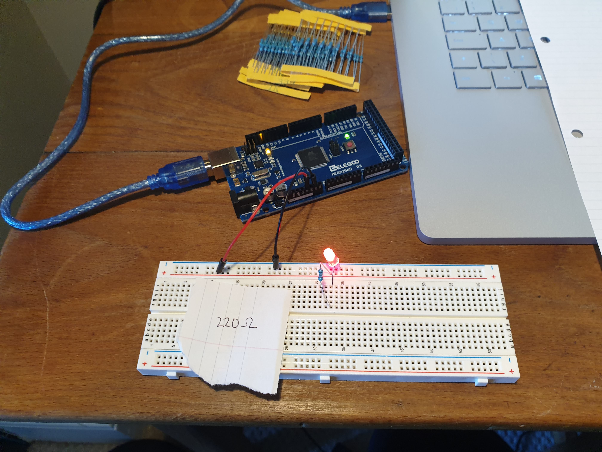

# Notes week 1 - Exploring Arduino and the starter kit

## Task 1 - The basics of Arduino programming

**What:** Simple tasks involving setting up and trying out different reistors and a potentiometer with LEDs and an RGB LED.

**Video of potentiometer:** https://github.com/hannahjayneknight/Gizmo2021/blob/main/Week1/potentiometer.mp4 

## Task 2 - Turning on/off an LED using a digital ouptut

**Files:** MyBlink.ino, Task1.ino  

**What:** Making an LED blink.

**Videos of results:** https://github.com/hannahjayneknight/Gizmo2021/blob/main/Week1/blinking.mp4 

## Task 3 - Receiving information from users

**Files:** SerialOutput.ino, SerialMonitor.ino, pass_checking.ino, custom_keypad.ino  

**What:** Small project whereby a user can enter a 4 digit password using the keypad. The code assesses if it is correct or not and feedsback to the user using the Serial Monitor.

**Videos of results:** No videos were recorded but the task was demonstrated to my tutor.