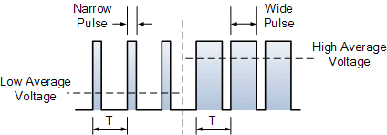
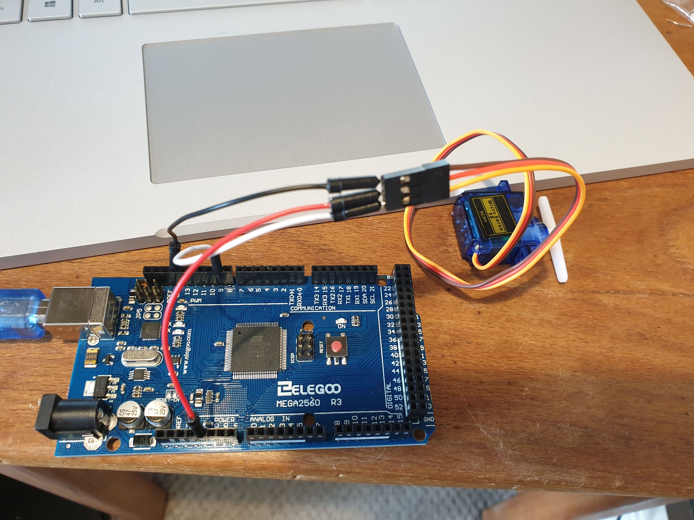

# Notes week 2 - Controlling motors and other actuators

## Task 1 - Controlling an RGB LED

**Files** RGB_LED_NR.ino, all_colours_task1.ino  

**What:**  _Pulse-Width Modulation_ was used to obtain multple colours using an RGB LED. _Nested for-loops_ were used to go through all the possible colours from RGB(255, 0, 0) to RGB(255, 255, 255).  

**Explanation:** Pulse-Width Modulation is the process of turning on and off a digital signal. The signal appears to be a constant voltage which equals the average voltage of the pulse wave. The _duty cycle_ is the percentage of time the digital signal is on in a single period and this determines the average voltage: average voltage = duty cycle x max voltage.

**Notes:** This task was fairly simple. Although fiddly, the desired result was achieved.   

**Videos of results:** 

## Task 2 - Controlling servos

**Files** servo.ino, my_servo.ino  

**What:**  Pulse-Width Modulation was used to change the position of the servo from vertical to horizontal. Duty cycle was used to determine the angle.  

**Notes:** This task was fairly simple and only required the changing of a couple of numbers and the removal of certain sections of code.  

**Videos of results:** 

## Task 3 - Controlling DC motors

**Files** DC_motor_NR.ino, DC_motor_enter_speed.ino  

**What:**  Pulse-Width Modulation was used to change the speed of a DC motor. Duty cycle was used to determine the speed.  

Secondly, a sketch was written where a user could enter a desired speed (between 0 and 255) to the motor using the keypad. While the user inputs a new speed, the fans continues spinning at the same previous speed.  

**Notes:** This task was more challenging. Before linking to the motor, it took a long time to adapt the *pass_checking.ino* file. In the end, it was decided to force the user to input to a 3 digit character (using 0s where necessary) and use the # as the enter key. This may not create the nicest user interface but it was far easier to get working.  

However, when the code was linked to the motor, nothing seemed to happen. After some tests, it seemed that the motor had stopped working at some point during the initial exercise! It has been suggested by other classmates that the motors are extremely sensitive and easily break as many others' have broken, too.  

**Further improvements:** I would like to edit my code so that it can take any user input, not only 3 digit numbers requiring 0s as placeholders. This would create a better user interface and have broader applications. 

**Videos of results:** 