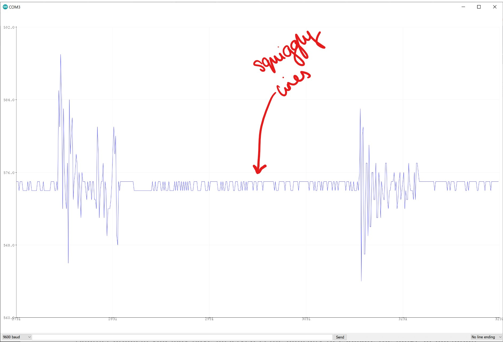
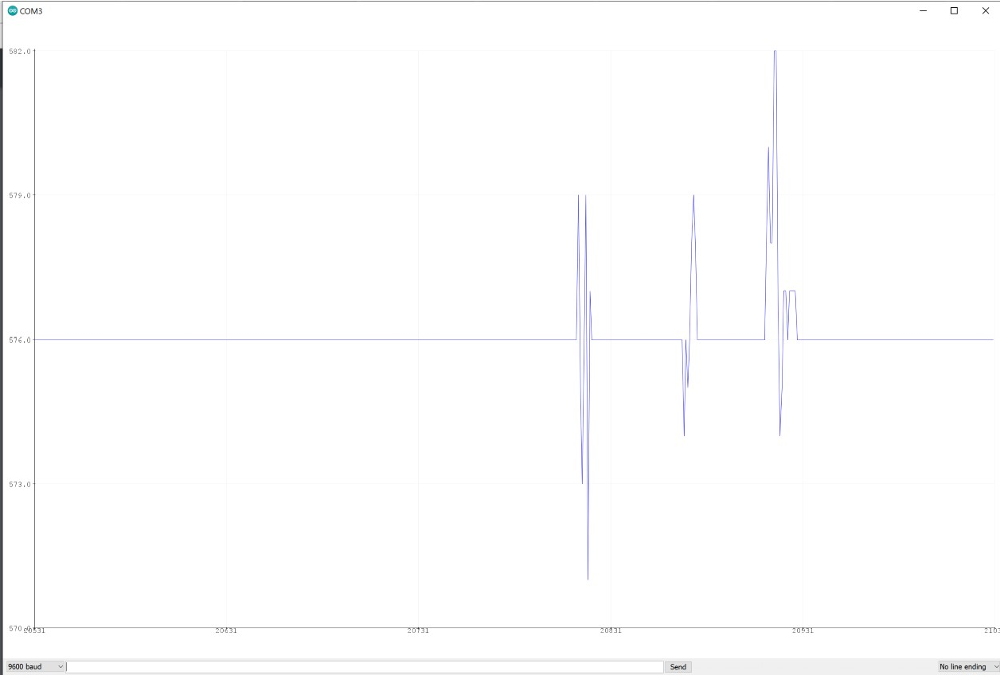
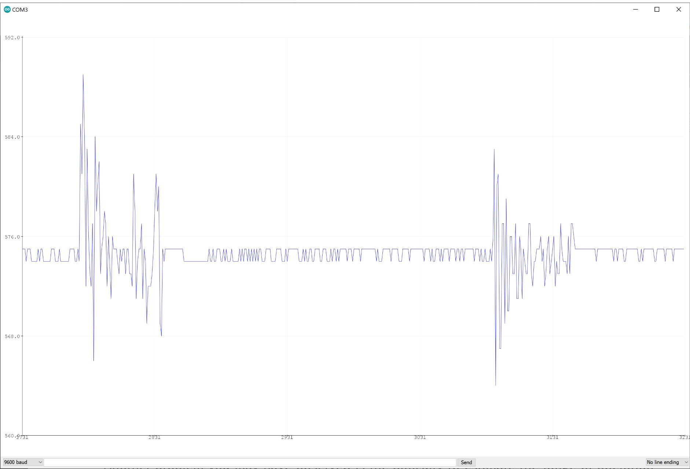

# Notes week 3

## Task 1

**Files**  sine_wave.ino, Sound_Sensor_Example_NR.ino, Task1.ino  

Sometimes, the wavefrom produced from the sound sensor output wasn't perfect.

The following helped get the perfect sound waveform using the sound sensor (i.e. no noise and detects speech not just sharp blows):
 - Adjust screw on sound sensor until LED2 just goes out. 
 - Attach the output wire to the correct pin.
 - Wait a minute or so before the sound sensor picks up sound to the right precision. 
 - Ensure there is no background noise when calibrating.

**How does LED2 work on the sound sensor?**  

**Finding the minimum and maximum output voltages when I talk**  

Talking into the microphone, the following plot was found. This means the range of my voice is between 566 and 586. NB: RGB(red, green, blue)
    566 = RGB(0, 255, 0)
    569 = RGB(35, 210, 0)
    572 = RGB(70, 175, 0)
    575 = RGB(105, 140, 0)
    578 = RGB(140, 105, 0)
    581 = RGB(175, 70, 0)
    584 = RGB(210, 35, 0)
    587 = RGB(255, 0, 0)

**Implementing the RGB bulb**  
Firstly, the bulb was setup using the same layout as last week. Each colour was tested to ensure it was working and the microphone was tested simultanously to checked the were working together.  

A range of delay times were tested. Too short a delay time and the change in colour wouldn't be seen. Too long a delay time and the lag would be too great to see the effect. In the end, a comprimise was found, although 

