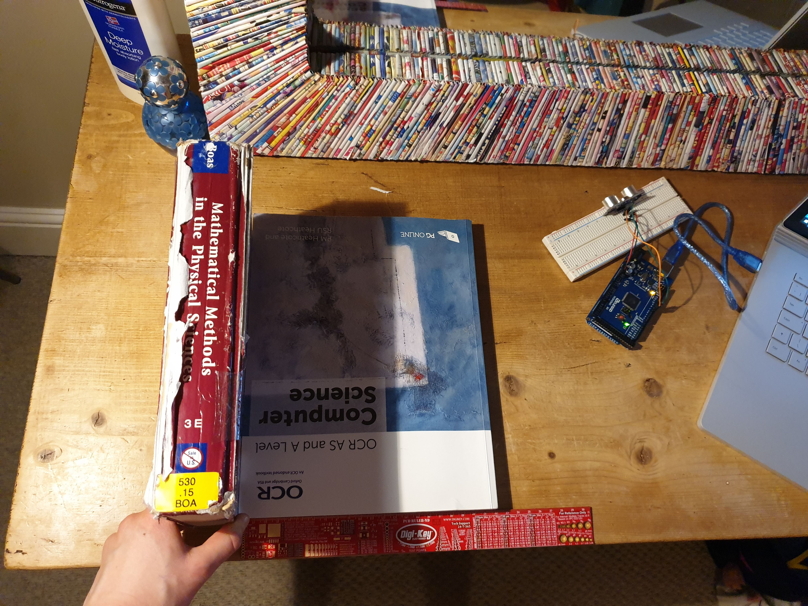
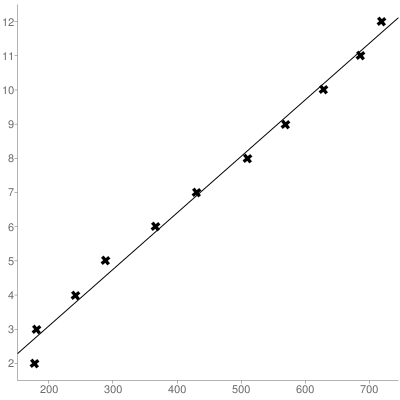

# Notes week 3

## Task 1

**Files**  sine_wave.ino, Sound_Sensor_Example_NR.ino, Task1.ino <br />

Sometimes, the wavefrom produced from the sound sensor output wasn't perfect.


The following helped get the perfect sound waveform using the sound sensor (i.e. no noise and detects speech not just sharp blows):
 - Adjust screw on sound sensor until LED2 just goes out. 
 - Attach the output wire to the correct pin.
 - Wait a minute or so before the sound sensor picks up sound to the right precision. 
 - Ensure there is no background noise when calibrating.


**How does LED2 work on the sound sensor?** <br />

**Finding the minimum and maximum output voltages when I talk** <br />

Talking into the microphone, the following plot was found. This means the range of my voice is between 566 and 586. NB: RGB(red, green, blue)
    566 = RGB(0, 255, 0)
    569 = RGB(35, 210, 0)
    572 = RGB(70, 175, 0)
    575 = RGB(105, 140, 0)
    578 = RGB(140, 105, 0)
    581 = RGB(175, 70, 0)
    584 = RGB(210, 35, 0)
    587 = RGB(255, 0, 0)


**Implementing the RGB bulb** <br />
Firstly, the bulb was setup using the same layout as last week. Each colour was tested to ensure it was working and the microphone was tested simultanously to checked the were working together. <br />

A range of delay times were tested. Too short a delay time and the change in colour wouldn't be seen. Too long a delay time and the lag would be too great to see the effect. In the end, a comprimise was found. An alternative method is to remove the delays from the LEDs and have no initial setting fot the colour at the start of the loop. <br />

Overall, this task was quite challenging and difficult to measure how successful it was! <br />

**Notes on latency** The issues seen are due to the time delay between the instant the voice is sensed and when the corresponding value sampled is represented by the RGB LED. The affect of latency can become fustrating in human-machine interactions. Futher reading: https://link-springer-com.iclibezp1.cc.ic.ac.uk/chapter/10.1007/978-3-319-20681-3_13 https://en.wikipedia.org/wiki/Latency_(engineering) <br />

**Notes on the ranges I used** Whilst these ranges may be acceptable for my voice, they may not be for another user. To solve this problem, the sensor can be callibrated: https://www.arduino.cc/en/Tutorial/BuiltInExamples/Calibration. This technique was implemented in Task 2. <br />

## Task 2

**Files** Task2.ino <br />

I struggled getting the sound sensor to be sensitive enough to detect me solely speaking. However, it performed well when I blew on it, changing colour appropriately. <br />

This technique of calibrating involves taking a certain amount of time to input a range, from which a minimum and maximum value can be found to calibrate to. The map() function is used to homogenise the range linarly. Implementation of Arduino's map() function: <br />

```
long map(long x, long in_min, long in_max, long out_min, long out_max)
{
  return (x - in_min) * (out_max - out_min) / (in_max - in_min) + out_min;
}
```

## Task 3

**Files:**  SR04.cpp, SR04_Example_NR.ino <br />

**Introduction:** Sensor characterization is when you find a function (or set of functions) that map physical values to sensor readings. This task uses an ultrasonic sensor to explore this concept. <br />

**How the library computes the distance from time measured:** To calculate the distance between the object and the sensor, the HC-SR04 library manipulates the well-known  formula. <br />

The distance we are interested in is half the distance that the ultrasonic wave travels (which goes to the object and back again). The HC-SR04 library takes the speed of sound to be . Time is measured in microseconds = . <br />

Putting together all of the above gives the following:

 (in m) <br />

Which simplifies to:

 (in m) <br />

Or:

 (in cm) <br />


Specifically, the method MicrosecondsToCentimeter() that is used can be seen below. <br />

```
long SR04::MicrosecondsToCentimeter(long duration) {
    long d = (duration * 100) / 5882;
    //d = (d == 0)?999:d;
    return d;
}
```
**The experiment:** In this practical, the ultrasonic sensor was used to measure how far away a textbook was.

**Setup:** Other books were used to place the textbook (to be measured) and the sensor (taking the measurements) at right angles to each other and to the ruler. This ensured the readings were as accurate as possible (given the circumstances of completing the practical at home).



**Video example of me taking a reading at 2cm:** https://github.com/hannahjayneknight/Gizmo2021/blob/main/Week3/2cm-reading.mp4 <br />


**Results:**
| Time reading 1 (micro-seconds) | Time reading 2 (micro-seconds) | Time reading 3 (micro-seconds) | Average time (micro-seconds) | Distance set (cm) |
|--------------------------------|--------------------------------|--------------------------------|------------------------------|---------------|
| 178                            | 178                            | 178                            | 178.00                       | 2             |
| 181                            | 181                            | 181                            | 181.00                       | 3             |
| 241                            | 241                            | 242                            | 241.33                       | 4             |
| 289                            | 289                            | 289                            | 289.00                       | 5             |
| 365                            | 370                            | 364                            | 366.33                       | 6             |
| 428                            | 431                            | 431                            | 430.00                       | 7             |
| 508                            | 515                            | 508                            | 510.33                       | 8             |
| 571                            | 566                            | 572                            | 569.66                       | 9             |
| 628                            | 628                            | 628                            | 628.00                       | 10            |
| 686                            | 686                            | 686                            | 686.00                       | 11            |
| 717                            | 716                            | 723                            | 718.66                       | 12            |

| Sample size | Mean x (x̄) | Mean y (ȳ) |
|-------------|------------|------------|
| 11          | 436.21     | 7          |

**Regression line of the data:** <br />

[//]: #y=0.016527999408284x-0.20967862188755

 <br />

NB: The following website was used to calculate the linear regression: http://www.alcula.com/calculators/statistics/linear-regression/#gsc.tab=0 <br />




**Conclusion:** The utrasonic sensor is extremely accurate! <br />

Although the expected linear regression line was , the calculated one of  (which has been rounded) is only marginally incorrect. This means the sensor has a high precision.
