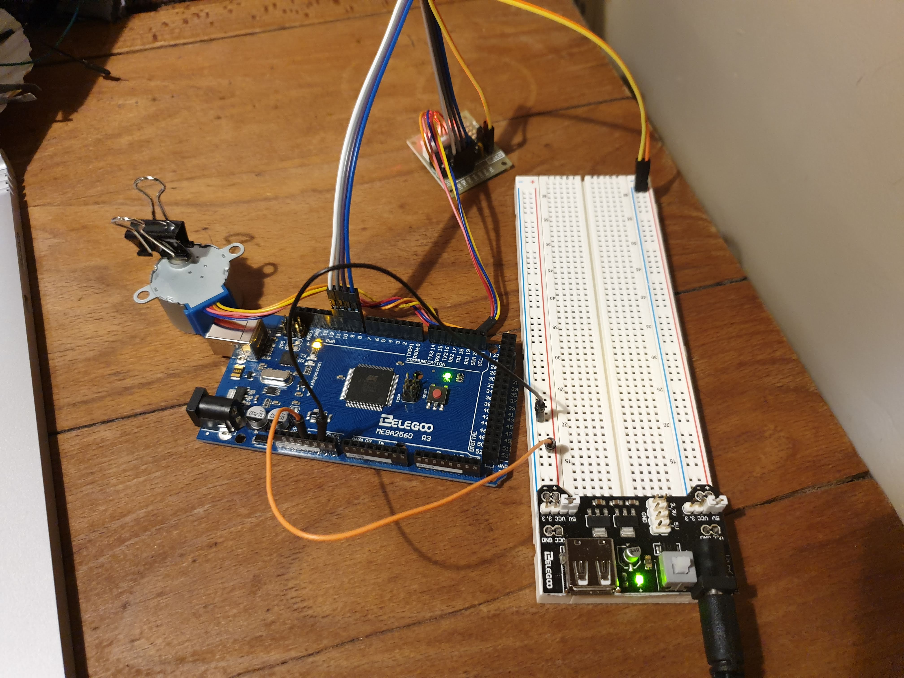

# Notes week 4 - Dealing with a concurrent physical world

## Task 1 - Reacting to changes in orientation

**Files** Ball_Switch.ino, Task1.ino, Task1-attempt2.ino<br />

Firstly, a simple circuit was set-up to try using the tilt sensor. This all ran smoothly. <br />

Setup (not tilted so the LED is on):


In a tilted position (LED is off): 


Then, a LED was added to the circuit to see the effects of code order on when/if the LED lit up. The LED was coded to be on for 5 seconds, followed by being off for 5 seconds and repeat. This code was trialled (1) before the code for the tilt sensor and (2) after the code for the tilt sensor. <br />

The results were the same for both scenarios. <br />

The red LED blinked constantly as desired, however, the led on the board which indicates whether it is tilted or not responded but not until long after the change in position had happened. This is probably due to te fact that during the delay set for the red LED, the code is not "listening" for changes in position of the tilt sensor. <br />

The solution has been based on the following article: https://arduino.stackexchange.com/questions/37684/can-i-make-multiple-void-loops-with-arduino-uno <br />

Here, different functions are made both for the red LED and the tilt sensor. The tilt sensor function does exactly the same as it did before and the red LED function no longer uses ```delay()``` methods. Instead, each time the led function is called it checks for how much time has passed since the previous time it was called. The result can be seen in the _Task1-attempt2.ino_ file. <br />

**Video of tilt sensor working on its own:** https://github.com/hannahjayneknight/Gizmo2021/blob/main/Week4/tilt-sensor.mp4 <br />

**Video of tilt sensor and LED working together:** https://github.com/hannahjayneknight/Gizmo2021/blob/main/Week4/tilt_and_LED.mp4 <br />

## Task 2 - Controlling a stepper motor

**Files** stepper_Example.ino, <br />

**About the stepper motor:** 
- The sequence of the applied pulses is directly related to the direction of the motor shaft's rotation.
- The speed of the motor shafts rotation is directly related to the frequency of the input pulses. 
- The length of rotation is directly related to the number of input pulses. <br />



At first, when I followed the set-up outlined in the lesson, my stepper motor did not turn on at all. I realised it was missing a wire from the 5V pin on the Arduino to the breadboard. I added this in, but still, no luck. I tried connecting the power supply to various terminals wondering if I got that completely wrong. Still, no luck. Out of desperation, I plugged the Arduino into my laptop, which dutifully complained about the power demand from it and decided to stop supplying power completely. I decided to restart my laptop, leave it for a while then come back. <br />

I was worried I had broken my motor (like last week!) so decided to slowly build up the circuit before adding in the motor. When I was confident in my circuit, I added in the motor and this time there was noise (yay!) but, the motor didn't appear to be moving. <br />

After some fiddling, in the end all that was needed was for _both_ of the output voltages on the power supply module to be set to 5V. This gave the desired result.


**Video of stepper motor exercise:**  <br />

To change the rotation to half rotations, the variable ```stepsPerRevolution``` was simply halved.

For Task 2, the stepper motor was coded to increase speed from 5 rpm, to 10 rpm to 15 rpm with each full rotation and then go back to 5 rpm again. <br />

Note that the starting position was not controlled during this task. Whatever is the motor's initial starting position will be the starting position.

The serial port was used to ensure the speed of the stepper motor:


**Video of Task 2:**  <br />

## Task 3 - Attending events when they happen

**Files** Interrupts.ino <br />

When we first combined the red LED with the tilt sensor, the system didn't work the way we wanted to because of _polling_. This is where the computer waits for an external device to check for its readiness or state and does nothing until this device is ready. <br />

In this exercise, we use _interrupts_ which are signals sent from a device or from software to the operating system. The interrupt signal causes the operating system to temporarily stop what it is doing and ‘service’ the interrupt. This allows the system to run specific pieces of code called _Interrupt Service Routines (or ISRs)_. <br />

The Arduino function ```attachInterrupt()``` allows us to do this easily. 

**Breakdown of _Interrupts.ino_ :** In the loop() of _Interrupts.ino_, you have the redLED blinking. The tilt sensor is only defined in setup() where the interrupt is defined which links to the builtin() function to define what to do depending on the signal from the tilt sensor. The builtin() function is the interrupt handler (aka ISR) which means it tells the computer what to do when the device raises an interrupt. <br />

When we define the interrupt in setup(), we tell the computer that whenever the state of the tilt sensor changes it needs to perform the builtin() function (which is the ISR).
