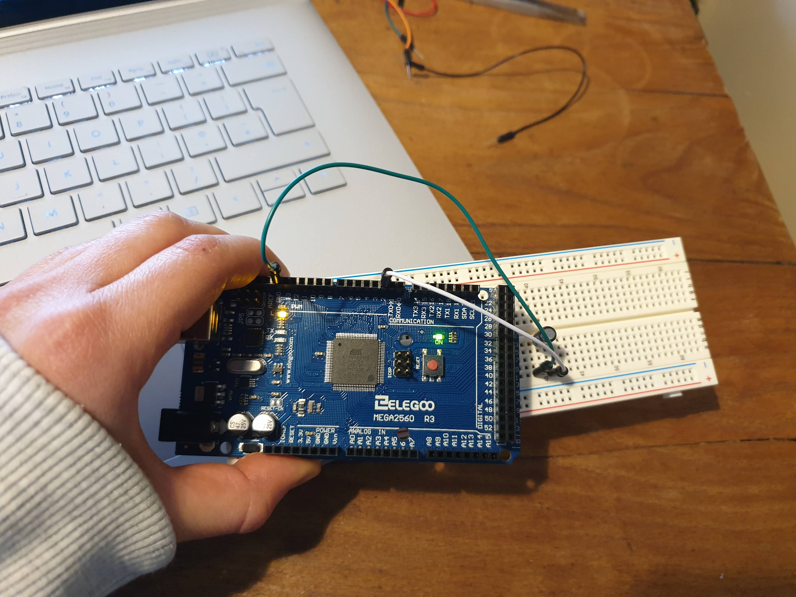

# Notes week 4 - Dealing with a concurrent physical world

## Task 1 - Reacting to changes in orientation

**Files** Ball_Switch.ino, Task1.ino, Task1-attempt2.ino<br />

Firstly, a simple circuit was set-up to try using the tilt sensor. This all ran smoothly. <br />

Setup (not tilted so the LED is on):



In a tilted position (LED is off): 


Then, a LED was added to the circuit to see the effects of code order on when/if the LED lit up. The LED was coded to be on for 5 seconds, followed by being off for 5 seconds and repeat. This code was trialled (1) before the code for the tilt sensor and (2) after the code for the tilt sensor. <br />

The results were the same for both scenarios. <br />

The red LED blinked constantly as desired, however, the led on the board which indicates whether it is tilted or not responded but not until long after the change in position had happened. This is probably due to te fact that during the delay set for the red LED, the code is not "listening" for changes in position of the tilt sensor. <br />

The solution has been based on the following article: https://arduino.stackexchange.com/questions/37684/can-i-make-multiple-void-loops-with-arduino-uno <br />

Here, different functions are made both for the red LED and the tilt sensor. The tilt sensor function does exactly the same as it did before and the red LED function no longer uses ```delay()``` methods. Instead, each time the led function is called it checks for how much time has passed since the previous time it was called. The result can be seen in the _Task1-attempt2.ino_ file. <br />

**Video of tilt sensor working on its own:** <br />

**Video of tilt sensor and LED working together:** <br />

## Task 2 - Controlling a stepper motor

**Files** Ball_Switch.ino, Task1.ino, Task1-attempt2.ino<br />

**About the stepper motor:** 
- The sequence of the applied pulses is directly related to the direction of the motor shaft's rotation.
- The speed of the motor shafts rotation is directly related to the frequency of the input pulses. 
- The length of rotation is directly related to the number of input pulses.

<br />

